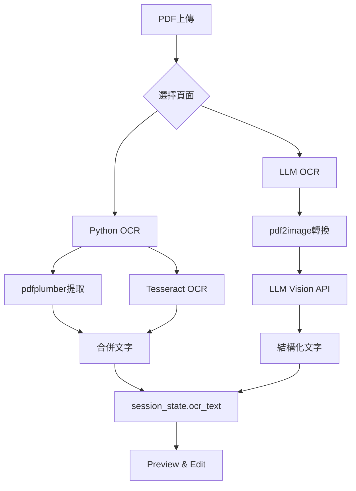
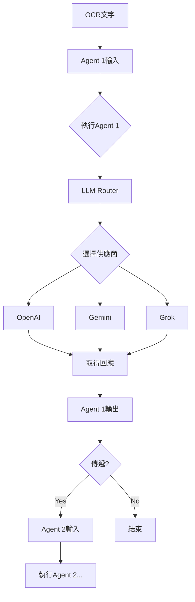

# TFDA Agentic AI輔助審查系統 - 技術規格書
## Technical Specification Document v2.0

---

## 📋 **目錄 Table of Contents**

1. [系統概述 System Overview](#system-overview)
2. [架構設計 Architecture Design](#architecture)
3. [技術堆疊 Technology Stack](#tech-stack)
4. [功能規格 Functional Specifications](#functional-specs)
5. [資料流程 Data Flow](#data-flow)
6. [API整合 API Integration](#api-integration)
7. [部署規格 Deployment Specifications](#deployment)
8. [安全性考量 Security Considerations](#security)
9. [效能指標 Performance Metrics](#performance)
10. [未來擴展 Future Enhancements](#future)

---

## <a name="system-overview"></a>1. 系統概述 System Overview

### 1.1 目的 Purpose
TFDA Agentic AI輔助審查系統是一個智慧型文件分析平台，專為醫療器材與藥品審查流程設計，整合多個AI模型提供自動化文件處理、OCR識別、智慧代理分析及互動式文件標註功能。

### 1.2 核心價值 Core Value Propositions
- **多模型整合**: 支援OpenAI GPT、Google Gemini、xAI Grok三大AI平台
- **彈性工作流**: 可自定義代理流程，支援1-31個專業代理並聯或串聯
- **視覺化分析**: 即時效能監控、token使用追蹤、處理時間分析
- **多語言介面**: 繁體中文/英文雙語切換
- **美學設計**: 20種花卉主題配色，支援明暗模式

### 1.3 目標用戶 Target Users
- 醫療器材審查人員
- 藥品查驗登記審查專家
- 法規事務專業人員
- 臨床試驗文件管理者
- 醫藥研發機構

---

## <a name="architecture"></a>2. 架構設計 Architecture Design

### 2.1 系統架構圖

```
┌─────────────────────────────────────────────────────────────┐
│                     Frontend Layer                           │
│  ┌──────────────┐  ┌──────────────┐  ┌──────────────┐      │
│  │   Streamlit  │  │  Theme       │  │  Language    │      │
│  │   Web UI     │  │  System      │  │  Manager     │      │
│  └──────────────┘  └──────────────┘  └──────────────┘      │
└─────────────────────────────────────────────────────────────┘
                            ↓
┌─────────────────────────────────────────────────────────────┐
│                  Application Layer                           │
│  ┌──────────────┐  ┌──────────────┐  ┌──────────────┐      │
│  │   PDF        │  │   OCR        │  │   Document   │      │
│  │   Processor  │  │   Engine     │  │   Highlighter│      │
│  └──────────────┘  └──────────────┘  └──────────────┘      │
│  ┌──────────────┐  ┌──────────────┐  ┌──────────────┐      │
│  │   Agent      │  │   LLM        │  │   Analytics  │      │
│  │   Manager    │  │   Router     │  │   Dashboard  │      │
│  └──────────────┘  └──────────────┘  └──────────────┘      │
└─────────────────────────────────────────────────────────────┘
                            ↓
┌─────────────────────────────────────────────────────────────┐
│                    Service Layer                             │
│  ┌──────────────┐  ┌──────────────┐  ┌──────────────┐      │
│  │   OpenAI     │  │   Gemini     │  │   Grok       │      │
│  │   API        │  │   API        │  │   API        │      │
│  └──────────────┘  └──────────────┘  └──────────────┘      │
│  ┌──────────────┐  ┌──────────────┐  ┌──────────────┐      │
│  │  pdfplumber  │  │  Tesseract   │  │  pdf2image   │      │
│  └──────────────┘  └──────────────┘  └──────────────┘      │
└─────────────────────────────────────────────────────────────┘
                            ↓
┌─────────────────────────────────────────────────────────────┐
│                     Data Layer                               │
│  ┌──────────────┐  ┌──────────────┐  ┌──────────────┐      │
│  │   Session    │  │   YAML       │  │   Export     │      │
│  │   State      │  │   Config     │  │   Files      │      │
│  └──────────────┘  └──────────────┘  └──────────────┘      │
└─────────────────────────────────────────────────────────────┘
```

### 2.2 模組說明 Module Descriptions

#### 2.2.1 Frontend Layer
- **Streamlit Web UI**: 主要使用者介面框架
- **Theme System**: 20種花卉主題配色管理
- **Language Manager**: 中英文語言切換系統

#### 2.2.2 Application Layer
- **PDF Processor**: PDF渲染、頁面預覽、分頁選擇
- **OCR Engine**: Python-based與LLM-based雙模式OCR
- **Document Highlighter**: 關鍵字互動標註系統
- **Agent Manager**: 代理配置與執行管理
- **LLM Router**: 多模型智慧路由與負載均衡
- **Analytics Dashboard**: 即時效能監控與視覺化

#### 2.2.3 Service Layer
- **OpenAI API**: GPT模型整合
- **Gemini API**: Google Gemini模型整合
- **Grok API**: xAI Grok模型整合
- **OCR Libraries**: pdfplumber, Tesseract, pdf2image

#### 2.2.4 Data Layer
- **Session State**: Streamlit會話狀態管理
- **YAML Config**: 代理配置檔案
- **Export Files**: JSON/Markdown/HTML輸出

---

## <a name="tech-stack"></a>3. 技術堆疊 Technology Stack

### 3.1 核心框架

| 技術 | 版本 | 用途 |
|------|------|------|
| Python | 3.9+ | 主要開發語言 |
| Streamlit | 1.28+ | Web應用框架 |
| PyYAML | 6.0+ | YAML配置解析 |
| Pandas | 2.0+ | 資料處理 |
| Plotly | 5.17+ | 互動式圖表 |

### 3.2 AI/ML庫

| 技術 | 版本 | 用途 |
|------|------|------|
| OpenAI Python SDK | 1.3+ | GPT模型API |
| Google Generative AI | 0.3+ | Gemini模型API |
| xAI SDK | 0.0.1a2+ | Grok模型API |

### 3.3 文件處理

| 技術 | 版本 | 用途 |
|------|------|------|
| pdfplumber | 0.10+ | PDF文字提取 |
| pdf2image | 1.16+ | PDF轉圖片 |
| pytesseract | 0.3.10+ | OCR文字識別 |
| Pillow | 10.0+ | 圖片處理 |
| python-markdown | 3.5+ | Markdown渲染 |

### 3.4 部署環境

| 平台 | 配置 |
|------|------|
| Hugging Face Spaces | Streamlit應用主機 |
| Python Runtime | 3.9-3.11 |
| Memory | 推薦16GB+ |
| Storage | 10GB+ |

---

## <a name="functional-specs"></a>4. 功能規格 Functional Specifications

### 4.1 Tab 1: Upload & OCR 📤

#### 功能清單
1. **PDF上傳**
   - 支援格式: .pdf
   - 最大檔案大小: 200MB
   - 拖放上傳支援

2. **PDF檢視器**
   - 內嵌PDF檢視框架
   - 縮放功能
   - 頁面導航
   - Base64編碼顯示

3. **頁面選擇**
   - 範圍模式: "1-5, 7, 9-12"
   - 個別選擇: 複選框介面
   - 最多渲染30頁預覽
   - 4列縮圖網格顯示

4. **OCR配置**
   - **Python OCR模式**:
     - pdfplumber文字提取
     - Tesseract影像OCR
     - 語言: 英文/繁體中文
   - **LLM OCR模式**:
     - 模型選擇: Gemini 2.5 Flash/Flash Lite, GPT-4o Mini
     - 視覺理解OCR
     - 表格識別與Markdown轉換

5. **輸出格式**
   ```
   [PAGE 1 - TEXT]
   <提取的文字內容>
   
   [PAGE 1 - OCR]
   <OCR識別內容>
   ```

### 4.2 Tab 2: Preview & Edit ✏️

#### 功能清單
1. **文字編輯器**
   - 多行文字區域
   - 500px高度
   - 即時編輯OCR結果

2. **關鍵字高亮器**
   - 輸入關鍵字（逗號分隔）
   - 預設關鍵字: "藥品,適應症,不良反應"
   - Markdown藍色高亮: `**:blue[keyword]**`

### 4.3 Tab 3: Document Paste & Highlight 🎨

#### 功能清單
1. **文件貼上**
   - 支援格式: Text, Markdown, JSON, CSV
   - 300px高度輸入框
   - 即時格式識別

2. **互動式關鍵字標註**
   - 關鍵字輸入框
   - 顏色選擇器 (預設: #FF6B6B)
   - 新增/刪除關鍵字按鈕
   - 視覺化關鍵字列表

3. **快速預設組**
   - 醫療術語組: 藥品, 適應症, 不良反應, 禁忌
   - FDA關鍵字組: approved, safety, clinical, efficacy
   - 一鍵清除所有

4. **預覽渲染**
   - Markdown → HTML渲染
   - JSON → 格式化縮排 + 高亮
   - CSV → DataFrame顯示 + 高亮
   - 文字 → 直接高亮

5. **匯出選項**
   - Markdown下載
   - HTML下載（含CSS樣式）
   - 複製到剪貼簿提示

### 4.4 Tab 4: Agent Config ⚙️

#### 功能清單
1. **代理數量選擇**
   - 滑桿: 1-31個代理
   - 動態顯示選定數量

2. **全域系統提示**
   - 150px高度文字區域
   - 套用至所有代理
   - 預設內容: FDA專家提示

3. **個別代理配置**
   - 展開式面板（預設第一個展開）
   - 系統提示編輯（150px）
   - 模型選擇下拉選單
   - 溫度滑桿: 0.0-2.0（步進0.1）
   - 最大Token數: 64-8192（步進64）

4. **模型選項**
   - gpt-4o-mini
   - gpt-5-nano
   - gemini-2.5-flash
   - gemini-2.5-flash-lite
   - grok-3-mini

### 4.5 Tab 5: Execute ▶️

#### 功能清單
1. **前置檢查**
   - OCR文字存在驗證
   - 警告訊息顯示

2. **輸入重置**
   - 重置Agent 1輸入為OCR文字
   - 成功通知

3. **代理執行流程**
   - 代理步驟卡片視覺化
   - 可編輯輸入框（200px）
   - 執行按鈕（主要樣式）
   - 傳遞按鈕（Agent i → Agent i+1）

4. **執行結果**
   - 延遲時間顯示
   - Token使用量
   - 供應商資訊
   - 輸出文字框（300px）

5. **效能指標卡片**
   - 延遲（秒）
   - Token數
   - 供應商名稱

6. **匯出功能**
   - JSON下載（完整會話）
   - Markdown報告下載
   - 會話恢復上傳

### 4.6 Tab 6: Dashboard 📊

#### 功能清單
1. **摘要指標**
   - 總處理時間（秒）
   - 總Token使用量
   - 平均延遲
   - 執行代理數

2. **圖表視覺化**
   - **代理延遲長條圖**（按供應商著色）
   - **Token使用長條圖**（按供應商著色）
   - **供應商分布圓餅圖**

3. **流程視覺化**
   - Graphviz流程圖
   - 節點顯示: 代理名稱、供應商、延遲、Token
   - 有向連接線

4. **詳細指標表**
   - Pandas DataFrame
   - 欄位: agent, provider, latency, tokens
   - 格式化顯示

### 4.7 Tab 7: Review Notes 📝

#### 功能清單
1. **筆記編輯器**
   - 500px高度
   - Markdown支援
   - HTML顏色標籤支援
   - 會話內持久化

2. **預覽渲染**
   - Markdown → HTML
   - unsafe_allow_html=True

3. **AI問題生成**
   - 模型: gpt-4o-mini
   - 溫度: 0.5
   - 最大Token: 500
   - 輸出: 3-5個後續問題（Markdown清單）
   - 自動附加至筆記末尾

---

## <a name="data-flow"></a>5. 資料流程 Data Flow

### 5.1 OCR處理流程



### 5.2 代理執行流程



### 5.3 會話狀態管理

```python
st.session_state = {
    'theme': str,              # 花卉主題名稱
    'dark_mode': bool,         # 明暗模式
    'language': str,           # zh_TW / en
    'agents_config': list,     # 代理配置陣列
    'ocr_text': str,          # OCR結果文字
    'page_images': list,       # [(idx, PIL.Image), ...]
    'agent_outputs': list,     # [{input, output, time, tokens, provider, model}, ...]
    'selected_agent_count': int,
    'run_metrics': list,       # [{agent, latency, tokens, provider}, ...]
    'review_notes': str,
    'pasted_doc': str,
    'highlight_keywords': list, # [(keyword, color), ...]
    'pdf_bytes': bytes,
    'selected_pages': list     # [0, 1, 2, ...]
}
```

---

## <a name="api-integration"></a>6. API整合 API Integration

### 6.1 LLM Router架構

```python
class LLMRouter:
    def __init__(self):
        self._openai_client = OpenAI(api_key=os.getenv("OPENAI_API_KEY"))
        genai.configure(api_key=os.getenv("GEMINI_API_KEY"))
        self._xai_client = XAIClient(api_key=os.getenv("XAI_API_KEY"))
    
    def generate_text(model_name, messages, params) -> (str, dict, str):
        # 路由至對應供應商
        # 回傳: (回應文字, 使用資訊, 供應商名稱)
    
    def generate_vision(model_name, prompt, images) -> str:
        # Vision模型呼叫
```

### 6.2 API金鑰管理

#### 優先順序
1. **環境變數** (推薦)
   ```bash
   export OPENAI_API_KEY="sk-..."
   export GEMINI_API_KEY="AI..."
   export XAI_API_KEY="xai-..."
   ```

2. **網頁輸入** (後備)
   - 僅當環境變數未設定時顯示輸入框
   - 密碼型態輸入
   - 即時驗證連線狀態

### 6.3 API呼叫參數

| 參數 | 類型 | 預設值 | 說明 |
|------|------|--------|------|
| model | str | - | 模型名稱 |
| messages | list | - | 對話歷史 |
| temperature | float | 0.4 | 創造性 0.0-2.0 |
| top_p | float | 0.95 | 核心採樣 |
| max_tokens | int | 800 | 最大輸出Token |

### 6.4 錯誤處理

```python
try:
    response = router.generate_text(model, messages, params)
except Exception as e:
    st.error(f"❌ API錯誤: {str(e)}")
    # 記錄錯誤、顯示友善訊息
```

---

## <a name="deployment"></a>7. 部署規格 Deployment Specifications

### 7.1 Hugging Face Spaces配置

#### 檔案結構
```
tfda-agentic-ai/
├── app.py                 # 主應用程式
├── agents.yaml            # 代理配置檔
├── requirements.txt       # Python依賴
├── packages.txt          # 系統依賴 (Tesseract)
├── README.md             # 文檔
└── .gitignore
```

#### requirements.txt
```
streamlit>=1.28.0
openai>=1.3.0
google-generativeai>=0.3.0
xai-sdk==0.0.1a2
pdfplumber>=0.10.0
pdf2image>=1.16.0
pytesseract>=0.3.10
Pillow>=10.0.0
pandas>=2.0.0
plotly>=5.17.0
PyYAML>=6.0
python-markdown>=3.5
graphviz>=0.20
```

#### packages.txt
```
tesseract-ocr
tesseract-ocr-chi-tra
tesseract-ocr-eng
poppler-utils
graphviz
```

### 7.2 環境變數配置

在Hugging Face Spaces設定頁面新增:
```
OPENAI_API_KEY=sk-proj-...
GEMINI_API_KEY=AIzaSy...
XAI_API_KEY=xai-...
```

### 7.3 啟動命令

Hugging Face自動偵測Streamlit應用:
```bash
streamlit run app.py --server.port 7860
```

---

## <a name="security"></a>8. 安全性考量 Security Considerations

### 8.1 API金鑰保護
- ✅ 環境變數儲存
- ✅ 不在程式碼中硬編碼
- ✅ 網頁輸入使用密碼型態
- ✅ 不記錄金鑰至日誌

### 8.2 檔案上傳限制
- 僅接受PDF檔案
- 建議檔案大小限制: 200MB
- 臨時檔案自動清理

### 8.3 輸入驗證
- 頁碼範圍驗證
- YAML格式驗證
- 模型名稱白名單

### 8.4 會話隔離
- Streamlit會話狀態獨立
- 無跨用戶資料洩漏

---

## <a name="performance"></a>9. 效能指標 Performance Metrics

### 9.1 目標指標

| 指標 | 目標值 |
|------|--------|
| PDF渲染時間 | <3秒 (10頁) |
| Python OCR | <5秒/頁 |
| LLM OCR | <10秒/頁 |
| 代理執行 | <15秒/代理 |
| UI回應時間 | <1秒 |

### 9.2 優化策略

1. **並行處理**
   - 多頁OCR並行
   - 非同步API呼叫

2. **快取機制**
   - PDF渲染結果快取
   - API回應快取

3. **Token優化**
   - 智慧Token估算
   - 提示詞精簡

---

## <a name="future"></a>10. 未來擴展 Future Enhancements

### 10.1 短期計畫 (1-3個月)

1. **PDF標註功能**
   - 繪圖工具
   - 註解添加
   - 螢光筆標記

2. **對比檢視**
   - 原始vs OCR並排顯示
   - 差異高亮

3. **批次處理**
   - 多檔案上傳
   - 佇列管理
   - 進度追蹤

### 10.2 中期計畫 (3-6個月)

1. **模板庫**
   - 儲存代理配置
   - 分享模板
   - 社群模板市場

2. **協作審查**
   - 多用戶註解
   - 審查歷史
   - 評論系統

3. **OCR品質評分**
   - 信心分數
   - 問題區域標記
   - 人工複核提示

### 10.3 長期計畫 (6-12個月)

1. **資料庫整合**
   - PostgreSQL儲存
   - 審查歷史追蹤
   - 進階搜尋

2. **自訂模型訓練**
   - Fine-tuning介面
   - 領域特定模型
   - 模型版本管理

3. **API服務化**
   - RESTful API
   - Webhook整合
   - 第三方整合SDK

---

## 附錄 Appendix

### A. 花卉主題配色表

| 主題 | 主色 | 次色 | 強調色 | 圖示 |
|------|------|------|--------|------|
| 櫻花 | #FFB7C5 | #FFC0CB | #FF69B4 | 🌸 |
| 玫瑰 | #E91E63 | #F06292 | #C2185B | 🌹 |
| 薰衣草 | #9C27B0 | #BA68C8 | #7B1FA2 | 💜 |
| 鬱金香 | #FF5722 | #FF8A65 | #E64A19 | 🌷 |
| 向日葵 | #FFC107 | #FFD54F | #FFA000 | 🌻 |
| ... | ... | ... | ... | ... |

### B. 翻譯對照表

| 繁體中文 | English |
|---------|---------|
| 上傳與OCR | Upload & OCR |
| 預覽與編輯 | Preview & Edit |
| 代理設定 | Agent Config |
| 執行 | Execute |
| 儀表板 | Dashboard |
| 審查筆記 | Review Notes |

### C. 錯誤代碼

| 代碼 | 說明 | 處置 |
|------|------|------|
| E001 | API金鑰無效 | 檢查環境變數 |
| E002 | PDF解析失敗 | 檢查檔案完整性 |
| E003 | OCR逾時 | 減少頁面數 |
| E004 | Token限制超出 | 調整max_tokens |
| E005 | 模型不可用 | 切換供應商 |

---

**文件版本**: 2.0  
**最後更新**: 2024-11-12  
**維護者**: TFDA AI Team  
**聯絡**: support@tfda-ai.example.com
